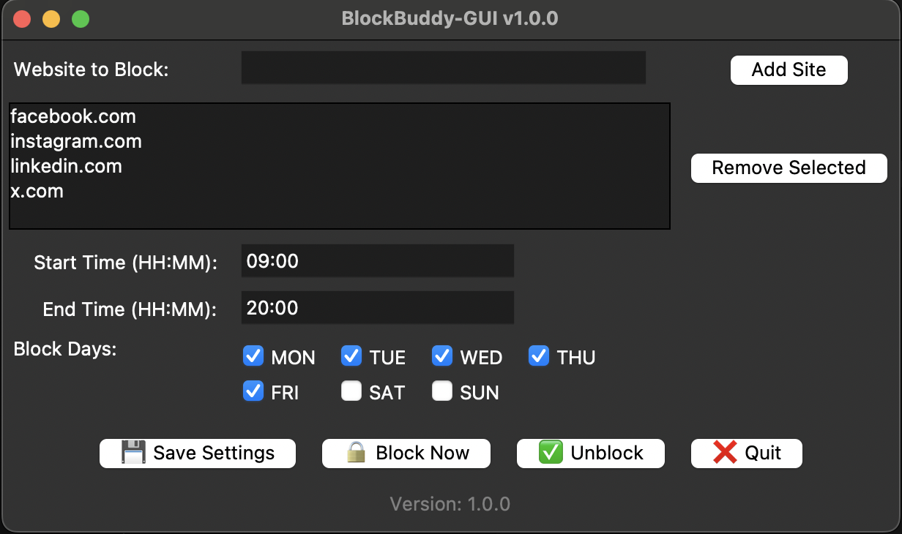

# BlockBuddy-GUI

- **Version:** 1.0.0
- **Platform:** macOS (initial release)

A friendly desktop app to help you block distracting websites based on your custom schedule. Designed for macOS, BlockBuddy-GUI lets you define:

* 🌐 Websites to block
* 🕐 Block start & end times
* 📅 Days of the week to enforce blocking
* ✅ One-click "Block" and "Unblock"
* 💾 Persistent config stored in `config.json`

---

## 🚀 Features

* Simple and clean Tkinter GUI
* `/etc/hosts` based blocking (root permission required)
* Time-aware and day-specific scheduling
* Configurable via visual interface — no terminal editing required

---

## 🛠 Requirements

* Python 3.x
* macOS
* `python-dotenv` (for future CLI compatibility)


---

## 📁 Project Structure

```
BlockBuddy-GUI/
├── main.py              # GUI application
├── blocker_engine.py    # Core blocking logic
├── config.json          # User-defined settings
├── version.py           # App version info
├── requirements.txt     # Dependencies
```

---

## ⚙️ How to Run

```bash
sudo python3 main.py
```

> 🛑 `sudo` is required to modify `/etc/hosts`

---

## 💡 Example Usage

1. Add sites like `facebook.com`, `instagram.com`
2. Set block time: 23:00 to 09:00
3. Select days: Mon–Fri
4. Click **Save Settings**
5. Click **Block Now** to apply rules immediately

## 📅 Interface Preview



> This is the main interface of BlockBuddy-GUI.  
> Users can add websites, set a time range, choose block days, and control blocking with one click.


---

## 📦 Versioning

This project follows [Semantic Versioning](https://semver.org/).
Current version is stored in `version.py` and displayed in the GUI.

---


---

## 📜 License
MIT – use it or improve it as you like.


